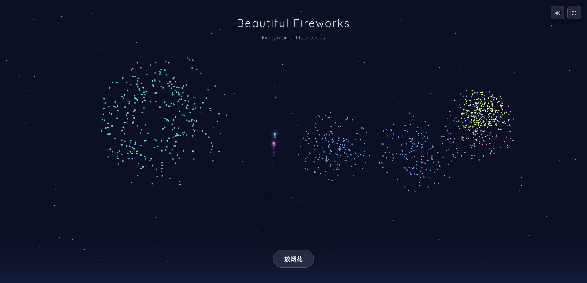

<!--
  It is recommended to place a preview screenshot named preview.png or screenshot.png in the project root directory,
  and replace the placeholder link below. Suggested size 1280×720 to better showcase fireworks and sound effects.
-->

<p align="center">
  
  
  
  
</p>

<h1 align="center">🎆 焰火 · Fireworks</h1>
<p align="center"><i>“点燃烟花，感受这个美好的时刻”</i><br>一款治愈系网页应用，用数字烟火定格日常中的诗意瞬间。</p>
<p align="center"><i>"Light fireworks and savor the beauty of the moment."</i><br>A soothing web application that captures poetic moments with digital fireworks.</p>

<p align="center">
  <a href="https://www.yangyifei1990.com/" target="_blank">✨ 在线体验 / Live Demo</a> •
  <a href="#-快速开始">🚀 快速开始 / Quick Start</a> •
  <a href="#-功能特性">🎯 功能特性 / Features</a> •
  <a href="#-版本历程">📜 版本历程 / Changelog</a>
</p>

<p align="center">
  
  <br>
  <sub>项目实际截图 / Actual screenshot</sub>
</p>

---

## 🎯 功能特性 / Features

- 🎆 **动态烟花系统 / Dynamic Fireworks** – 点击或拖拽即可绽放风格迥异的烟花，每次绽放都是一场小型视觉盛宴。/ Click or drag to launch various fireworks – each burst is a mini visual feast.
- 🔊 **沉浸式音效 / Immersive Sound** – 烟花升空、爆裂、余音环绕，提供真实的听觉反馈（可一键静音）。/ Realistic audio feedback with lift-off, explosion, and echo effects (one-click mute).
- 🌈 **华丽视觉效果 / Gorgeous Visuals** – 粒子拖尾、光晕、随机色彩曲线，深夜模式下格外治愈。/ Particle trails, glows, random color curves – especially soothing in dark mode.
- 📱 **响应式设计 / Responsive Design** – 桌面、平板、手机均能获得完整的烟花体验。/ Full experience on desktop, tablet, and mobile.
- ⚡ **轻量快速 / Lightweight & Fast** – 纯前端实现，零依赖，打开即燃。/ Pure front-end, zero dependencies, ready to burn.

## 🚀 快速开始 / Quick Start

你只需一个现代浏览器（Chrome / Edge / Safari / Firefox 最新版），即可立即体验。  
All you need is a modern browser (latest Chrome / Edge / Safari / Firefox).

### 在线使用 / Online Usage
直接访问项目主页：👉 [https://www.yangyifei1990.com/](https://www.yangyifei1990.com/)

### 本地运行 / Local Development
```bash
# 1. 克隆仓库 / Clone the repository
git clone https://github.com/你的用户名/fireworks.git
cd fireworks

# 2. 用任意静态服务器运行（推荐 live-server） / Run with any static server (live-server recommended)
npx live-server
```
或者直接双击 `index.html` 文件，浏览器将自动打开本地烟花。  
Or simply double-click `index.html` to open the local fireworks.

> 提示 / Tip：音频需要在用户首次点击页面后才能激活（浏览器自动播放策略），点击画布任意位置即可启用全部音效。  
> Audio requires first user click due to browser autoplay policy – click anywhere on canvas to enable all sounds.

## 🧰 技术栈 / Tech Stack

| 领域 / Area | 技术 / Technology |
|:---:|:---:|
| 核心 / Core | 原生 JavaScript (ES6+) |
| 渲染 / Rendering | HTML5 Canvas + requestAnimationFrame |
| 音频 / Audio | Web Audio API |
| 样式 / Styling | CSS3 (Flexbox/Grid, 渐变, 关键帧动画) |
| 构建 / Build | 无构建工具，直接运行 / Zero config, runs directly |

## 📜 版本历程 / Changelog

### v1.0.3 (当前版本 / Current) – 听觉升级 / Audio Upgrade ✨
- 新增完整音效系统（升空、爆炸、余音三种独立音频）/ Added full sound system (lift-off, explosion, echo)
- 优化粒子物理效果，烟火拖尾更平滑 / Improved particle physics, smoother trails
- 加入静音切换按钮，适配不同使用场景 / Added mute toggle for different scenarios

### v1.0.2 – 工程化改造 / Structural Refactor 🏗️
- 将单一 HTML 拆分为 `index.html`、`style.css`、`fireworks.js` / Split single HTML into separate files
- 引入模块化代码组织，便于后续迭代 / Modular code organization for easier iteration
- 修复移动端触屏事件冲突 / Fixed touch event conflicts on mobile

### v1.0.1 – 初代发布 / Initial Release 🚀
- 基础烟花交互（鼠标点击 / 触摸）/ Basic fireworks interaction (click/touch)
- Canvas 粒子系统与色彩库 / Canvas particle system & color library
- 响应式布局，适配主流分辨率 / Responsive layout for major resolutions

## 🤝 贡献指南 / Contributing

欢迎任何形式的贡献！不论是新特效、性能优化，还是文档修缮。  
Any form of contribution is welcome – new effects, performance tweaks, or documentation improvements.

1. **Fork** 本仓库 / this repository；
2. 新建特性分支：`git checkout -b feature/amazing-effect`；
3. 提交你的改动：`git commit -m 'Add some amazing effect'`；
4. 推送到分支：`git push origin feature/amazing-effect`；
5. 打开 **Pull Request**。

### 本地开发建议 / Local Development Tips
- 修改 `fireworks.js` 或 `style.css` 后直接刷新浏览器即可预览。/ Edit `fireworks.js` or `style.css` and refresh browser to preview.
- 若调整音频逻辑，请注意 Web Audio 需要在用户手势后初始化 `AudioContext`。/ If modifying audio logic, note that Web Audio requires user gesture to initialize `AudioContext`.

## 📄 许可证 / License

MIT License © 2025 [yangyifei1990](https://github.com/yangyifei1990)

## 💬 致谢 / Acknowledgements

- 灵感来源于现实中的烟花转瞬即逝的美 / Inspired by the ephemeral beauty of real fireworks.
- 音效素材来自 [Freesound](https://freesound.org/) 以及自行合成 / Sound effects from Freesound and self-made.
- 感谢每一位在夜空下驻足仰望的人 / Thanks to everyone who pauses and looks up at the night sky.

---

<p align="center">
  <i>如果这个项目让你感到片刻愉悦，不妨给颗 ⭐ 支持一下～</i><br>
  <i>If this project brings you a moment of joy, please give it a ⭐ – thank you!</i>
</p>